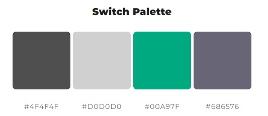
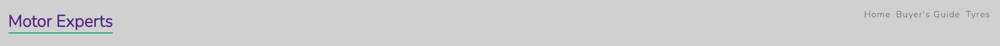
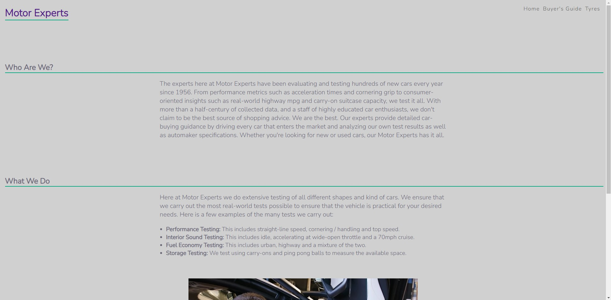
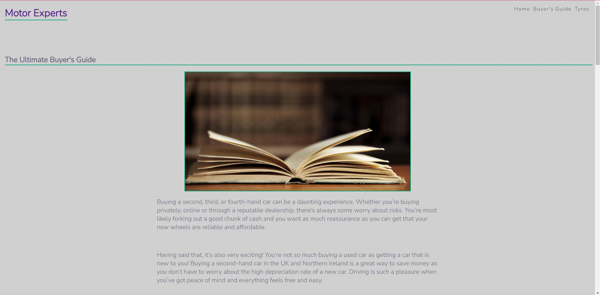
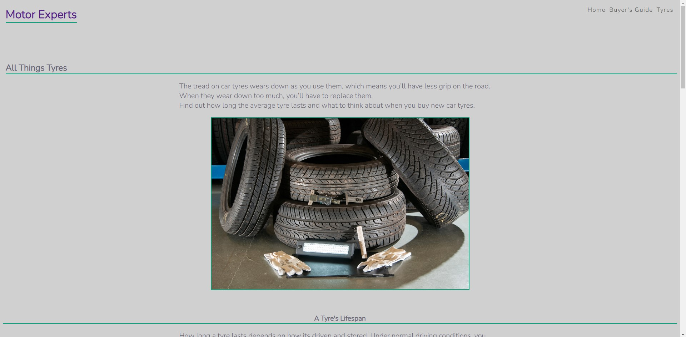
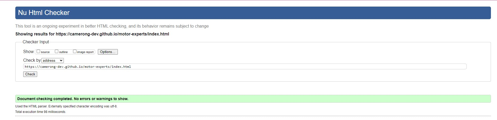
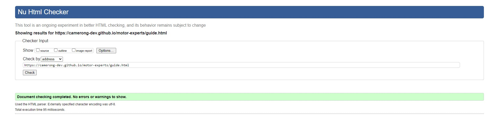
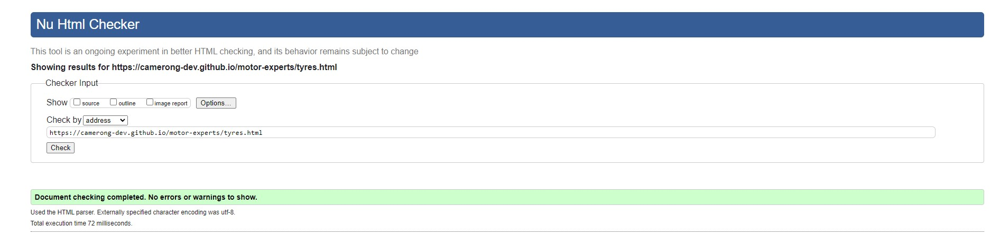
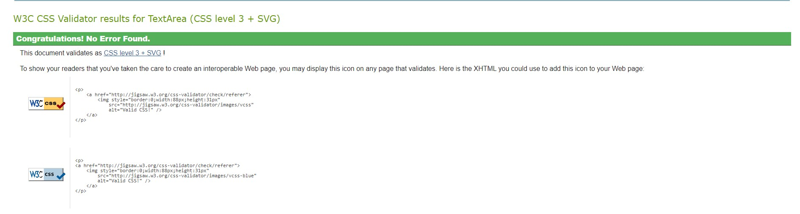
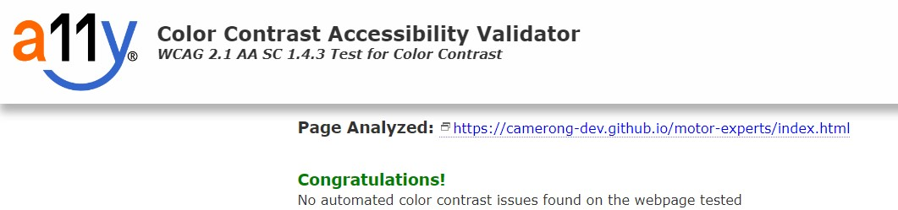

# Motor Experts

Motor Experts is a site that provides guides and advice for all things relating to cars. This site is targeted towards hopeful car buyers and/or the general public who want to find out more information on particular aspects of a car. 

## Live Site
[Motor Experts](https://camerong-dev.github.io/motor-experts/)

## Project Goals

- Showcase my understanding and knowledge of HTML and CSS
- Build a static front-end application with a simple and easy to follow UI

## Site Structure

Motor Experts is a 3 page website, with the home page being the default loading page. All other pages are accessed from the navigation bar at any given time. 

## Colour Scheme

My colour scheme will follow a simple, yet stylish aesthetic using greys and greens. I used [Colormind](http://colormind.io/) to generate random colour palettes to find the initial colour. From there I used [ColorSpace](https://mycolor.space/) to create a variety of colour palettes based off of one colour that I provided. 

Final Colour Palette:

## Fonts

The two fonts used were imported into the style.css file from [google fonts](https://fonts.google.com/). Quicksand was used for h1 and h2 elements for it's basic yet stylish appearance, which ties into the overall design of the site. Nunito was used for all other text as it matched Quicksands stylish and simple design. Sans-serif was the backup due to the basic design, allowing to fit perfectly into the site if the other fonts do not load. 

## Features

- Logo

  - The logo provides another easy way to access the home page. 
  

- Navigation Bar

  - Featured on all three pages, the responsive navigation bar inludes links to the Home page, Guides page and Tyres page. The style is consistent all across these         pages
  - This allows users to easily navigate between pages across all devices.
  

- Footer

  - The footer section includes links to relevant social media sites, the link will open in a new tab when the users selects the icon.
  - The footer icons change colour when the cursor is hovering over them, this adds to the small details of the site. 
  - The footer will be found on all pages of the site. 
  

- Home Page

  - This page gives the user an overview of who Motor Experts are and what they do. A auto-played video is found at the bottom of the 
    page showing off one of their tests. 

- Buyer's Guide Page

  - This page guides the user on the major things to look out for when buying a car. The page is clearly broken up into titled sections to ensure the page stays clean 
    and readable. Images are used to break up the large body of text. 

- Tyres Page

  - This page takes the user through all things relating to tyres. Following the same styling as the Buyer's Guide Page, it is clearly broken up into titled sections.     These titles ensure the user has understanding of the topic before even reading the body of text. 
  - A video is availble at the bottom of this page, clicking on the link takes you to YouTube where the user can find out more 
    information on the given topic. 

## Future Features
  
  - Submit guides/advice page. This page will allow a user to submit a guide or advice on a particular topic. This can then be implemented into the site if the 
    information is both relevant and acurate.
  - An advice page which includes divs containing an image and text as buttons, which leads to the information stated in the text.
  - A button taking the user back to the top of the page

## Testing

### HTML Validation Testing

  Home Page
  
  
  
  Buyer's Guide Page
  
  
  
  Tyres Page
  
  
  
### CSS Validation Testing

   
   
### Colour Contrast Validation

   
   
## Responsiveness

Responsive design test were carried out manually using Google Chrome's built in DevTools.

The following were tested:

  - iPhone 6/7/8/
  - iPhone 6/7/8 Plus
  - Samsung Galaxy S8+
  - Samsung Galaxy S20 Ultra
  - iPad Mini
  - Surface Pro 7 & Duo
  - Pixel 2
  - Nest Hub

## Deployment

The site was deployed to GitHub pages.

### Deploy to GitHub Pages

  1. Navigate to the settings tab in the GitHub repository
  2. Once in settings, navigate to the pages tab on the left of the page
  3. Under source, select branch ‘master’ and then click ‘save’
  4. The page will now automatically refresh and show a detailed ribbon display to indicate deployment
  
  settings tab image
  
### To create a Local Copy

  1. Under the repository name, click on the 'code' tab
  2. In your clone box, HTTPS tab, click on the clipboard icon
  3. In your IED open GitBash
  4. Chang the current working directory to the location you wish the cloned directory to be made
  5. Type 'git clone' and then paste the URL copied from GitHub
  6. Press enter and then the local clone will be created 
  
  ## Credits
  
  ### Content
  
   - Text for index.html was taken from [here](https://www.caranddriver.com/buying-guide/) and [here](https://www.caranddriver.com/features/a32018270/how-we-test-cars/)
   - Text for guide.html was taken from [here](https://strollinsurance.co.uk/blog/the-ultimate-used-car-buying-guide)
   - Text for tyres.html was taken from [here](https://www.theaa.com/driving-advice/safety/tyre-life-and-age)
    
 ### Media
 
   Images were taken from royalty free sources.
   Video on index.html was taken from [here](https://www.caranddriver.com/features/a32018270/how-we-test-cars/)
